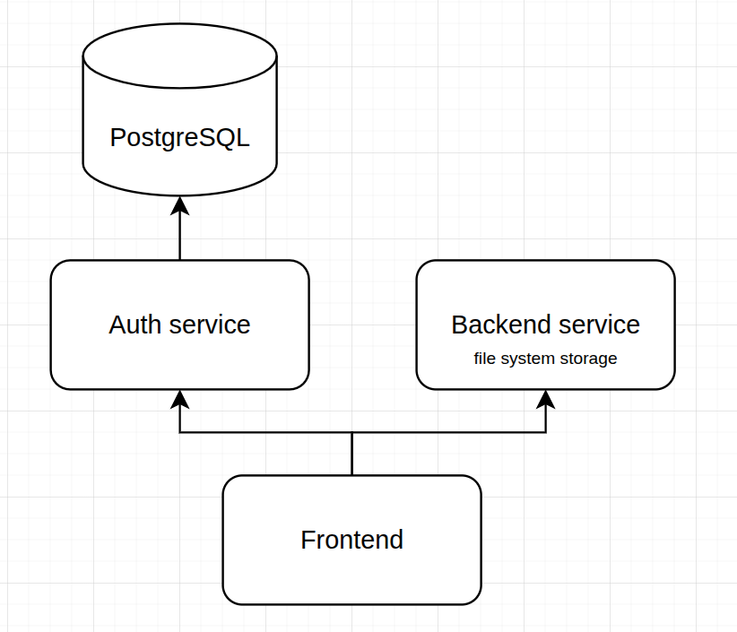

# Markdown Editor




Project requirements: [requirements.md](docs/requirements.md)

## Build

## Run using Docker Compose

The most easiest way to set up the project is Docker Compose:

1. Create `.env` file like `.env.example`

2. Run project:
 - To run all containers in a background (detach process)
```bash
docker-compose up -d
```
 - To attach all processes to the terminal session
```bash
docker compose up
```

### Build from source

#### Frontend

> Prerequisites: **Node.js ≥ 18 LTS** and **npm** (or `pnpm` / `yarn`).

```bash
# 1. Go to the frontend folder
cd frontend

# 2. Install dependencies
npm install

# 3. Add env variables in frontend/.env file:
# Example: 
VITE_AUTH_API_BASE_URL=http://localhost:8080
VITE_STORAGE_API_BASE_URL=http://localhost:1234

# 4. Start the dev server
npm run dev
```

Admin credentials:
- Username: `admin`
- Password: `password`
---

####  Backend

1. Create JWT_SECRET in .env file
2. Run:
```bash
cd backend
go mod tidy
go run . --host=localhost --port=YOUR_PORT
```

#### Auth service

> Prerequisites: **Go ≥ 1.23**, PostgreSQL.

1. Create JWT_SECRET in .env file
2. Run PostgreSQL instance:
```bash
cd auth
sudo apt install posgtresql
sudo -u postgres createdb auth_db # creates database
sudo -u postgres psql -d auth_db -f db/init.sql # creates table 'users'
```
3. Run:
```bash
export DB_ variables # env variables from .env.example
go mod tidy
go run . --host=localhost --port=YOUR_PORT
```

#### Swagger

Requirements:
- `swag` utility
Install it using:
```bash
$ go install github.com/swaggo/swag/cmd/swag@latest
# swag must be in $GOPATH/bin
```
Docs generation:

1. To generate documentation run:
```
cd backend
swag init
cd ../auth
swag init
```
2. To use see http://localhost:YOUR_PORT/swagger/index.html for auth and backend

---
## Tests

### Frontend

```bash
cd frontend
npm run test
```

### Backend

1. Create `backend/.env` file like `backend/.env.example`
2. Run:
```bash
cd backend
go test  -v
```

### Auth service

```bash
cd auth
go test -v
```
